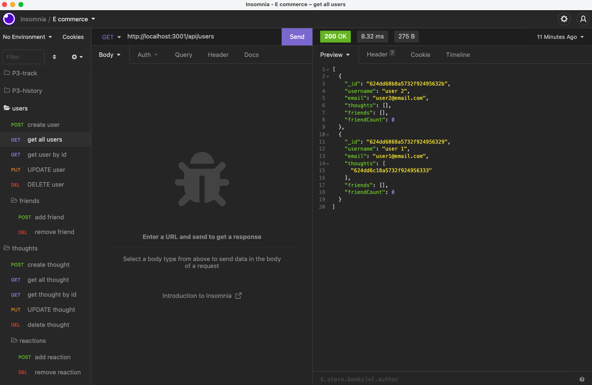

# NoSQL: Social Network API

## Table of Contents

- [Overview](#overview)
- [Technology Stack](#technology-stack)
- [Installation](#installation)
- [How to Use](#how-to-use)
- [License](#license)
- [Contributor](#contributor)
- [Contact](#contact)

## Overview:

The NoSQL: Social Network API is designed for a web application that facilitates social networking activities. Users can utilize this API to share their thoughts, interact with friends' thoughts, and manage their friend lists.

## Technology Stack:

This project is built using the following technologies:

- JavaScript
- Node.js
- Express.js
- MongoDB
- Mongoose

## Installation:

To deploy this project locally, follow these installation steps:

1. Clone the repository from GitHub.
2. Navigate to the project directory in your terminal.
3. Run the following command to install the required npm packages:

```bash
npm install
```

## How to Use:

Once you have installed the necessary npm packages, you can start the application with the following command:

```bash
npm start
```

### Walkthrough Video:

To get a visual demonstration of the application's functionality, watch the demo video [here](https://www.awesomescreenshot.com/video/8271915?key=4160443a4094cf7c0af7d25991652853).

### Insomnia Screenshot:



## License:

This project is licensed under the [MIT License](https://opensource.org/licenses/MIT). For more details, please visit the provided [MIT License information](https://opensource.org/licenses/MIT).

## Contributor:

This project was created by Wenwen Tian.

## Contact:

If you have any questions or need further information, please feel free to reach out:

- Email: [ktarkey47@gmail.com](mailto:wwtian9ktarkey47@gmail.com)
- GitHub Profile: [https://github.com/ktarkey12](https://github.com/ktarkey12)